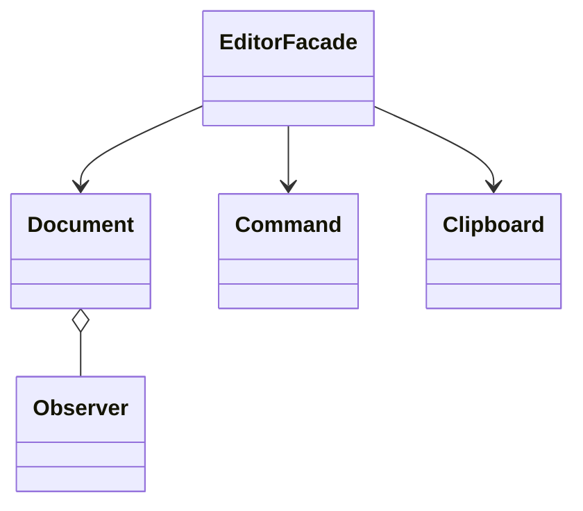
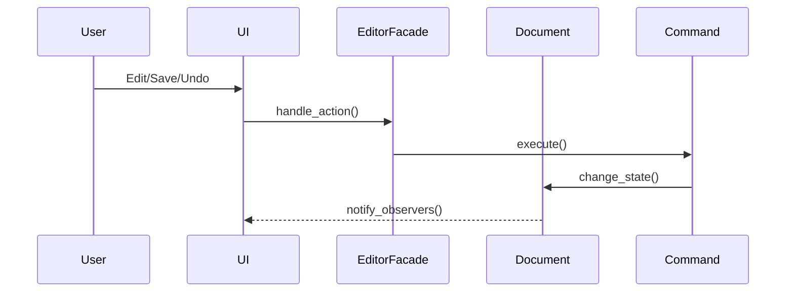

# UML README

У цьому файлі наведено архітектурну та поведінкову діаграми (UML) для проєкту текстового редактора.

## Архітектурна діаграма

Ця діаграма ілюструє основні компоненти системи та їх взаємозв'язки:

- **EditorFacade** — фасад для взаємодії з основними компонентами редактора.
- **Document** — модель документа, над яким виконуються операції.
- **Command** — патерн команд для виконання дій (редагування, скасування тощо).
- **Clipboard** — буфер обміну для копіювання/вставки.
- **Observer** — спостерігачі для відстеження змін у документі.

## Поведінкова діаграма

Ця діаграма демонструє послідовність дій при виконанні користувацьких операцій:

- **User** ініціює дію (редагування, збереження, скасування).
- **UI** передає дію фасаду редактора.
- **EditorFacade** делегує виконання відповідній команді.
- **Command** змінює стан документа.
- **Document** повідомляє UI про зміни через спостерігачів. 