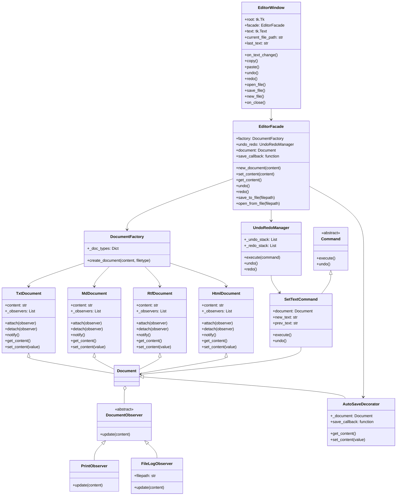
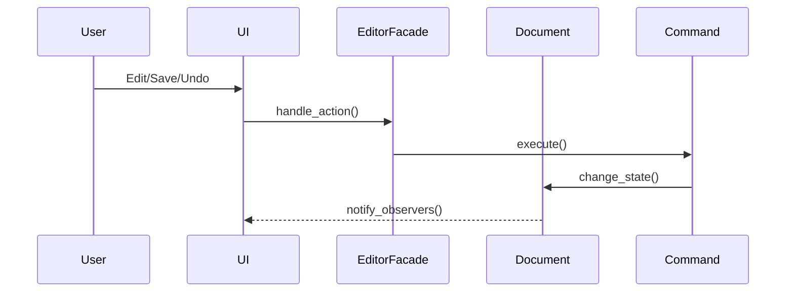

# UML README

У цьому файлі наведено архітектурну та поведінкову діаграми (UML) для проєкту текстового редактора.

## Архітектурна діаграма

Ця діаграма ілюструє повну архітектуру системи з усіма компонентами, їх атрибутами, методами та взаємозв'язками:

### Пояснення компонентів архітектури

#### 🖥️ **UI Layer (Шар інтерфейсу)**
- **EditorWindow** — головне вікно редактора (Tkinter)
  - Керує GUI елементами (текстове поле, меню, кнопки)
  - Обробляє користувацькі дії (введення тексту, копіювання, збереження)
  - Зберігає поточний шлях до файлу для автосейву
  - Делегує бізнес-логіку до EditorFacade

#### 🏗️ **Facade Layer (Фасад)**
- **EditorFacade** — спрощений інтерфейс для роботи з редактором
  - Інкапсулює складну логіку взаємодії між компонентами
  - Керує створенням документів через DocumentFactory
  - Координує роботу UndoRedoManager та AutoSaveDecorator
  - Надає простий API для UI

#### 🏭 **Factory Layer (Фабрика)**
- **DocumentFactory** — створює документи різних типів
  - Зберігає словник підтримуваних типів файлів
  - Повертає відповідний клас документа за розширенням
  - Дозволяє легко додавати нові типи документів

#### 📄 **Document Layer (Документи)**
- **TxtDocument, MdDocument, RtfDocument, HtmlDocument** — конкретні типи документів
  - Наслідують базовий Document
  - Можуть мати специфічну поведінку для кожного типу
  - Підтримують патерн Observer для сповіщення про зміни

#### 👀 **Observer Pattern (Спостерігачі)**
- **DocumentObserver** — абстрактний базовий клас для спостерігачів
- **PrintObserver** — виводить зміни у консоль
- **FileLogObserver** — логгує зміни у файл
- Дозволяє додавати будь-яку реакцію на зміну документа

#### 🎨 **Decorator Pattern (Декоратор)**
- **AutoSaveDecorator** — додає функціонал автозбереження
  - Обгортає будь-який Document
  - Автоматично зберігає при кожній зміні вмісту
  - Не змінює інтерфейс базового Document

#### ↩️ **Command Pattern (Команди)**
- **Command** — абстрактний базовий клас для команд
- **SetTextCommand** — конкретна команда зміни тексту
  - Зберігає попередній стан для відміни
  - Підтримує виконання та відміну операцій

#### 📚 **Undo/Redo Management**
- **UndoRedoManager** — керує історією команд
  - Зберігає стеки для undo та redo
  - Виконує команди та зберігає їх у історії
  - Дозволяє відміняти та повторювати дії

### Патерни проєктування

1. **Factory Method** — DocumentFactory створює документи
2. **Facade** — EditorFacade спрощує роботу з системою
3. **Observer** — Document сповіщає спостерігачів про зміни
4. **Decorator** — AutoSaveDecorator розширює функціонал Document
5. **Command** — SetTextCommand інкапсулює операції
6. **MVC** — розділення на Model (Document), View (EditorWindow), Controller (EditorFacade)

### Взаємозв'язки

- **EditorWindow** → **EditorFacade** — UI делегує логіку фасаду
- **EditorFacade** → **DocumentFactory** — фасад створює документи через фабрику
- **DocumentFactory** → **Document** — фабрика створює конкретні типи документів
- **Document** → **DocumentObserver** — документ сповіщає спостерігачів
- **Document** → **AutoSaveDecorator** — декоратор обгортає документ
- **UndoRedoManager** → **SetTextCommand** — менеджер керує командами
- **SetTextCommand** → **Document** — команда змінює документ

## Поведінкова діаграма

Ця діаграма демонструє послідовність дій при виконанні користувацьких операцій:

### Пояснення поведінкової діаграми

1. **User** ініціює дію (редагування, збереження, скасування)
2. **UI** (EditorWindow) отримує дію і передає її фасаду
3. **EditorFacade** аналізує дію і створює відповідну команду
4. **Command** (SetTextCommand) виконується і змінює стан документа
5. **Document** сповіщає всіх спостерігачів про зміни
6. **UI** отримує повідомлення і оновлює інтерфейс

### Переваги архітектури

- **Модульність** — кожен компонент має чітку відповідальність
- **Розширюваність** — легко додавати нові типи документів, спостерігачів, команд
- **Тестованість** — кожен компонент можна тестувати окремо
- **Гнучкість** — патерни дозволяють змінювати поведінку без зміни коду
- **Підтримка** — чітка структура спрощує розуміння та модифікацію коду 