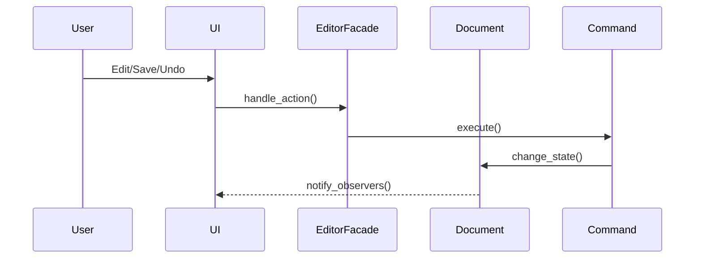

# Поведінкова діаграма (UML)

```mermaid
sequenceDiagram
    participant User
    participant UI
    participant EditorFacade
    participant Document
    participant Command
    User->>UI: Edit/Save/Undo
    UI->>EditorFacade: handle_action()
    EditorFacade->>Command: execute()
    Command->>Document: change_state()
    Document-->>UI: notify_observers()
```
